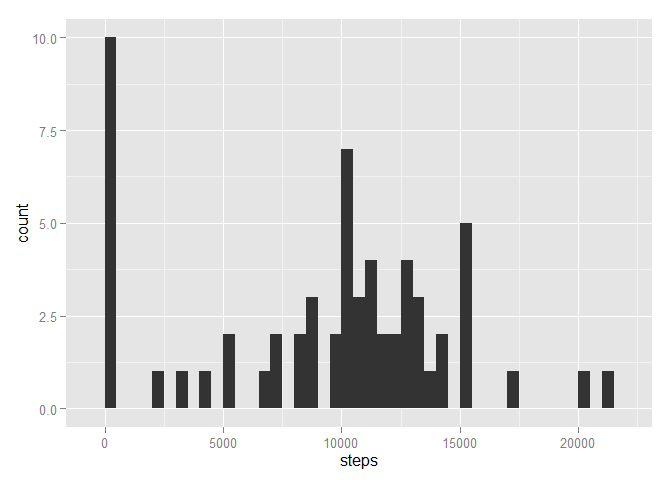
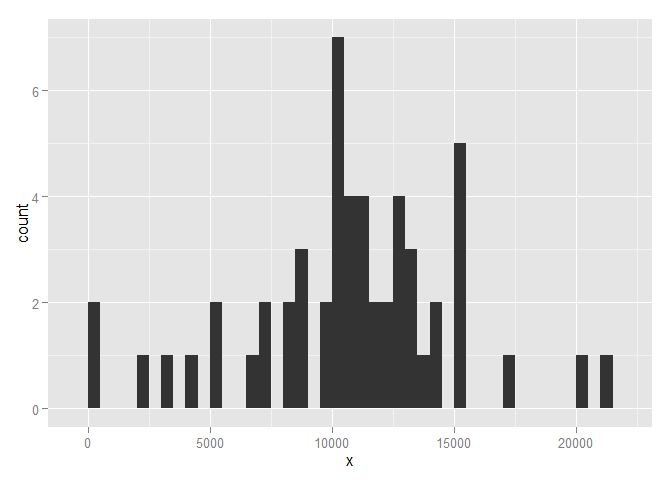
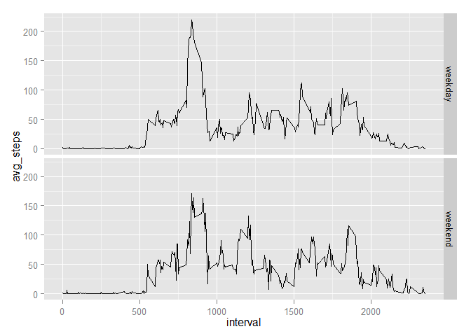

# Reproducible Research: Peer Assessment 1

## Loading and preprocessing the data


```r
require(ggplot2)
require(dplyr)
unzip("./activity.zip")
data <- read.csv("activity.csv")
```


## What is mean total number of steps taken per day?


```r
per_day <- data %>% 
    group_by(date) %>% 
    summarize(steps = sum(steps, na.rm = TRUE))

ggplot(aes(x = steps), data = per_day) + geom_histogram(binwidth = 500)
```

 

```r
mean(per_day$steps, na.rm=TRUE)
```

```
## [1] 9354.23
```

```r
median(per_day$steps, na.rm=TRUE)
```

```
## [1] 10395
```

## What is the average daily activity pattern?


```r
per_interval <- data %>%
    group_by(interval) %>%
    summarize(avg_steps = mean(steps, na.rm = TRUE))

ggplot(aes(x = interval, y = avg_steps), data = per_interval) + geom_line()
```

 

```r
per_interval$interval[which.max(per_interval$avg_steps)]
```

```
## [1] 835
```

## Imputing missing values


```r
missing_values <- sum(is.na(data$steps))
```

There are 2304 NA values in the dataset. 

When inserting the interval average (accross dates) for missing values, the summaries look the following.


```r
data_transformed <- merge(data, per_interval) %>% 
    mutate(x = ifelse(is.na(steps), avg_steps, steps)) %>%
    select(steps = x, date, interval)

per_day_transformed <- data_transformed %>% 
    group_by(date) %>% 
    summarize(steps = sum(steps))

ggplot(aes(x = steps), data = per_day_transformed) + geom_histogram(binwidth = 500)
```

 

```r
mean(per_day_transformed$steps)
```

```
## [1] 10766.19
```

```r
median(per_day_transformed$steps)
```

```
## [1] 10766.19
```

As you can see, the mean has grown quite significantly comparred to ignoring the missing values. The median is around the same value.

## Are there differences in activity patterns between weekdays and weekends?


```r
per_interval_weekday <- data_transformed %>%
    mutate(weekday = factor(ifelse(as.POSIXlt(date)$wday < 2, "weekend", "weekday"))) %>% 
    group_by(weekday, interval) %>% 
    summarize(avg_steps = mean(steps))

ggplot(aes(x = interval, y = avg_steps), data = per_interval_weekday) + 
    facet_grid(weekday ~ .) + 
    geom_line()
```

 
